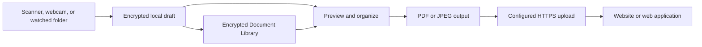

# TwainBridge

TwainBridge is a native macOS menu-bar application that turns scanners and cameras into secure upload tools for existing websites and web applications.

Capture a document from an Image Capture-compatible scanner, a webcam, or a watched folder; review it; then send it to a configured web endpoint. TwainBridge remembers the last-used choices so recurring work can usually be completed with a global shortcut, a quick review, and **Send**.

> [!IMPORTANT]
> TwainBridge uses Apple ImageCaptureCore/ICA for scanners. Despite the project name, it does not currently embed TWAIN Classic, SANE, or a vendor-specific scanner SDK. A watched folder is provided for scanners that only work through vendor software.

> [!NOTE]
> The application core is implemented and passes the automated release preflight. Production distribution still requires Developer ID signing and notarization, completed physical scanner/camera testing, and validation against the intended web receiver. See [Release status](#release-status).

## Table of contents

- [What it does](#what-it-does)
- [Core workflow](#core-workflow)
- [Features](#features)
- [Requirements](#requirements)
- [Install and run](#install-and-run)
- [First-time setup](#first-time-setup)
- [Configuration guide](#configuration-guide)
- [Using TwainBridge](#using-twainbridge)
- [Configuring the receiving endpoint](#configuring-the-receiving-endpoint)
- [Local storage, privacy, and security](#local-storage-privacy-and-security)
- [Build, test, and release](#build-test-and-release)
- [Troubleshooting](#troubleshooting)
- [Project structure](#project-structure)
- [Documentation](#documentation)
- [Author](#author)
- [Release status](#release-status)

## What it does

TwainBridge sits in the top-right macOS menu bar and connects local document capture to a web-based workflow.

It can:

- discover USB and network scanners exposed through macOS Image Capture;
- scan from a flatbed or automatic document feeder, including duplex when the device reports support;
- capture a document photo from a built-in, USB, or Continuity Camera;
- import PDF, JPEG, PNG, TIFF, and multipage TIFF/PDF files from a watched folder;
- preview, rotate, reorder, add, rescan, split, rename, or remove pages and documents;
- assemble single-page JPEG or multipage PDF output;
- upload one document or a multi-document batch to a configurable HTTPS endpoint;
- retain scanner documents and webcam photos in an encrypted local Document Library;
- reopen, export, or send a retained document again later;
- preserve actionable drafts through application restarts, interrupted scans, and upload failures.

TwainBridge is intended for workflows such as invoices, contracts, forms, case documents, identity documents, archival material, and other files that must move from a local capture device into a browser-based system.

## Core workflow



The normal repeat workflow is:

1. Trigger the scanner shortcut, webcam shortcut, or menu-bar action.
2. TwainBridge uses the saved device, acquisition settings, destination, and output defaults.
3. Review the captured pages in the workspace.
4. Enter only destination fields explicitly configured not to be remembered.
5. Press **Send** or **Send All**.
6. TwainBridge records the result and retains the encrypted local document when library storage is enabled.

Safety decisions are intentionally not remembered. Destructive deletion, destination-host changes, ambiguous non-idempotent retries, and exceptional size conflicts still require confirmation.

## Features

### Native menu-bar operation

- Runs as an `LSUIElement` menu-bar application without a permanent Dock window.
- Shows scanner/upload state, active drafts, the latest transfer, and quick actions.
- Opens separate workspace, webcam, library, and settings windows only when needed.
- Supports launch at login through `SMAppService`.
- Uses privacy-preserving native notifications.

### Scanner acquisition

- USB and network discovery through ImageCaptureCore.
- Capability-driven controls rather than hard-coded scanner assumptions.
- **Automatic**, **Flatbed**, and **Document Feeder** sources when available.
- Single-sided or duplex feeder acquisition.
- Color, grayscale, and black-and-white modes when reported.
- Device-supported resolution, page size, and orientation choices.
- Feeder-loaded state where the driver provides it.
- Progress, cancellation, and recoverable interruption handling.
- Per-scanner saved defaults.
- Physical scanner-button handling where the ICA driver delivers the event.

### Global scanner shortcut

- Optional system-wide shortcut implemented with Carbon hotkeys.
- Does not require Accessibility or Input Monitoring permission.
- Supports letters, numbers, and F1–F12 with Command, Option, Control, and Shift modifiers.
- Default suggestion: `⌥⌘S`, disabled until enabled.
- Starts a scan immediately with the selected scanner's saved profile.
- Detects registration conflicts and unsafe/busy states.

### Webcam capture

- Built-in, USB, external, and Continuity Camera discovery through AVFoundation.
- Dedicated live-preview window.
- Explicit camera selection and persistent last-used camera.
- Private recoverable staging before import into encrypted storage.
- Uses the same preview, document, destination, upload, and library workflow as scanner captures.

### Global webcam shortcut

- Independently configurable from the scanner shortcut.
- Default suggestion: `⌥⌘C`, disabled until enabled.
- Opens the webcam preview with the last-used camera.
- Reports conflicts with the scanner shortcut or another application.

### Watched-folder import

- Optional nonrecursive folder monitoring.
- Security-scoped folder access persisted across restarts.
- Waits until a file is stable before importing it.
- Supports `.pdf`, `.jpg`, `.jpeg`, `.png`, `.tif`, and `.tiff`.
- Expands multipage PDF and TIFF files while preserving document boundaries.
- Preserves the source file; TwainBridge does not rename or delete it.
- Prevents accidental duplicate imports and allows explicit reimport.
- Rejects corrupt files and symbolic links that escape the selected folder.

### Document workspace

- Focused send view by default: a fitted document preview, minimal multipage navigation, **Advanced…**, and **Send** or **Send All**.
- Blocking destination or authentication problems remain visible beside the simple send controls.
- **Advanced…** opens the complete document editor described below; **Simple View** returns to the focused workflow.
- Multi-document batches with explicit document boundaries.
- Full-page preview plus document and page sidebars.
- Rotate, reorder, delete, add pages, create another document, and rescan.
- Persistent preview fit mode and zoom.
- Per-document PDF/JPEG format and quality choices.
- Original, balanced, and smaller output-quality presets.
- Selected-document or complete-batch **Save Copy**.
- Read-only state for documents already confirmed by the receiver.
- **Send Again as New Copy** creates independent document, batch, and page IDs.
- Output-size estimates and safe recovery choices for destination limits.

### Multipage and multi-document delivery

- Multipage PDF output.
- Single-page JPEG output.
- One-document-only or multi-document destination policies.
- One multipart request containing the batch, or one request per document.
- Repeated, indexed, or custom per-document multipart file fields.
- Sequential or two-at-a-time per-document requests.
- Configurable page, document, file-size, and batch-size limits.
- Partial-success handling without silently resending confirmed documents.

### Encrypted Document Library

- New scanner, webcam, and watched-folder captures are retained by default.
- Search by document name or state.
- Filter by scanner, webcam, or watched-folder origin.
- Encrypted thumbnail and full-page preview.
- Shows document/page counts, capture date, destination, state, and approximate storage use.
- Reopens a retained item in the normal workspace.
- Exports confirmed documents without making them editable.
- Sends a completed item again as a new copy with fresh identifiers.
- Explicitly removes the local encrypted copy without affecting the remote receiver.
- Remains separate from metadata-only transfer history.

### Reliable upload behavior

- Streaming output and multipart construction for bounded memory use.
- Stable logical `document_id` and `batch_id` values across retries.
- New `request_id` for each individual attempt.
- Configurable idempotency header, default `Idempotency-Key`.
- Automatic retry for transient failures using 2, 10, and 30-second delays.
- Supports `Retry-After` with confirmation for unusually long delays.
- Waits while offline without consuming a retry attempt.
- Cancelling an upload preserves the draft.
- Persists per-document confirmations before continuing a batch.
- Distinguishes confirmed success, application failure, partial success, and ambiguous/unconfirmed responses.

### Configure-once behavior

TwainBridge persists operational choices so routine captures do not repeat setup questions:

- selected scanner and per-scanner acquisition profile;
- selected webcam;
- scanner and webcam shortcuts;
- active upload destination;
- PDF/JPEG and compression choices;
- preview zoom and fit mode;
- Test Connection options;
- destination-scoped non-sensitive posting values;
- sensitive reusable posting values stored in Keychain.

## Requirements

### To run the application

- macOS 15 or later.
- Apple Silicon or Intel Mac.
- A supported capture source:
  - scanner exposed through macOS Image Capture/ICA;
  - AVFoundation-compatible camera; or
  - a folder populated by scanner/vendor software.
- A receiving endpoint: trusted HTTPS for public hosts, or HTTP/HTTPS for a private local-network receiver.

### To build from source

- macOS 15 or later.
- Xcode 26 or later.
- [XcodeGen](https://github.com/yonaskolb/XcodeGen).
- `jq` for preflight validation.
- Python 3 for the reference receiver tests.

Install common command-line prerequisites with Homebrew:

```sh
brew install xcodegen jq
```

### Scanner drivers

The scanner must appear in Apple's Image Capture application or expose files through vendor software.

For the Epson WorkForce DS-1660W pilot, install Epson Scan 2/the current Epson ICA driver. Driver detection is implemented, but USB, infrastructure Wi-Fi, Wi-Fi Direct, ADF, duplex, and physical-button behavior still require completion of the physical [compatibility matrix](Docs/COMPATIBILITY_MATRIX.md).

## Install and run

### Build in Xcode

```sh
git clone <repository-url>
cd TwainBridge
xcodegen generate
open TwainBridge.xcodeproj
```

In Xcode:

1. Select the **TwainBridge** target.
2. Set your Apple Development team under **Signing & Capabilities**.
3. Select **My Mac**.
4. Run the **TwainBridge** scheme.

Use a consistent Apple Development identity for daily builds. Ad-hoc builds change code identity when rebuilt, which can cause macOS Keychain to ask for access repeatedly even after choosing **Always Allow**.

### Produce a local release-candidate bundle

```sh
Scripts/preflight.sh
```

The resulting unsigned/ad-hoc release-candidate bundle is written to:

```text
.build/ReleaseDerivedData/Build/Products/Release/TwainBridge.app
```

This bundle is suitable for automated verification, not normal distribution. Use the signed release process for installation on other Macs.

For an installable build on the development Mac, use:

```sh
Scripts/build-local-signed.sh
```

This produces a universal Apple Development-signed app in `.build/LocalSignedDerivedData/Build/Products/Release/`. Keep the same development team and bundle identifier so macOS camera and Keychain approvals remain valid after rebuilding. Never install the unsigned preflight bundle as the daily-use app.

## First-time setup

On first launch, TwainBridge opens a resumable setup assistant.

1. **Scanner and driver** — discover a scanner and optionally perform a test scan.
2. **Destination** — create or import a destination profile.
3. **Test Connection (optional)** — verify the receiver without sending a real scanned document.
4. **Notifications** — optionally enable privacy-preserving completion and error notifications.
5. **Launch at login** — optionally keep TwainBridge ready in the menu bar after login.

The application remains usable for local scanning and export without an upload destination. **Send** requires an enabled, valid profile; running **Test Connection** first is optional.

## Configuration guide

Open **Settings…** from the TwainBridge menu-bar window.

### Destinations

A destination is a reusable description of how TwainBridge communicates with a website or web application.

#### Connection

Configure:

- display name;
- absolute HTTPS endpoint URL;
- `POST` or `PUT` method;
- request timeout;
- enabled/disabled state;
- allowed cross-host redirect hosts;
- whether to open a validated returned URL after success.

Plain HTTP, embedded URL credentials, TLS bypasses, and unrestricted cross-host secret forwarding are intentionally unsupported.

#### Authentication

Supported authentication modes:

- **None**;
- **Bearer Token** using the `Authorization` header;
- **Custom Header** with a configurable header name.

Authentication values are stored in macOS Keychain and are excluded from exported profiles, logs, history, and diagnostics.

#### File and filename mapping

Configure:

- multipart file field name, default `file`;
- output filename pattern;
- accepted PDF and/or JPEG formats;
- repeated file fields, indexed fields, or a custom per-document field pattern;
- optional batch manifest and its field name.

Filename placeholders include:

- `{document_id}`
- `{batch_id}`
- `{index}`
- `{name}`
- `{date}`

#### Page and batch rules

Configure whether the receiver accepts:

- one or multiple pages per document;
- one or multiple documents per send;
- a maximum page count per document;
- a maximum document count per batch;
- one multipart batch request or one request per document;
- sequential or two-at-a-time document requests;
- only failed documents or the complete local batch after partial success;
- maximum output bytes per document and per batch.

For single-page receivers, additional pages can start a new document automatically, ask the user, or be rejected.

#### Posting parameters

Each custom parameter defines:

| Setting | Choices |
|---|---|
| Location | Header, multipart form field, or query string |
| Value source | Fixed, built-in, generated, or entered before sending |
| Scope | Request, batch, or individual document |
| Type | Text, integer, decimal, Boolean, date, date-time, or choice |
| Validation | Required, allowed values, minimum/maximum, length, or expression |
| Storage | Non-sensitive persistence or Keychain-backed sensitive persistence |

Built-in values are:

- `document_id`
- `batch_id`
- `filename`
- `page_count`
- `document_count`
- `scanned_at`
- `scanner_name`
- `content_type`
- `request_id`

User-entered values are remembered for that destination by default. Disable **Remember value** for fields that must change for every scan. Sensitive reusable values are stored only in Keychain.

#### Response interpretation

Choose one response mode:

- **Standard TwainBridge JSON** — reads `success`, `message`, `id`, `open_url`, and per-document results.
- **Status only** — accepts a configured HTTP success range without requiring JSON.
- **Custom JSON** — maps configured JSON paths to success, message, remote ID, browser URL, and document results.

Also configure:

- accepted HTTP status range, default `200...299`;
- whether an empty body is allowed;
- expected response content type;
- maximum response size, default 1 MiB;
- whether missing optional fields are allowed.

#### Idempotency and retries

Keep **Receiver supports idempotency** enabled when the endpoint safely deduplicates repeated logical IDs. The default idempotency header is `Idempotency-Key`.

If idempotency is disabled, TwainBridge does not automatically repeat an ambiguous request that may already have reached the server. The user must explicitly decide whether to retry.

#### Test Connection

**Test Connection** is optional and never uploads an existing scan. Every test automatically sends configured parameters plus a generated one-page file named `twainbridge-test.pdf`. There is no per-test file option to configure. The result is evaluated using the profile's response mapping, but it does not enable, disable, or gate normal sending.

### Scanning

Configure:

- default scanner;
- per-scanner source, sides, color mode, resolution, page size, and orientation;
- scanner shortcut enablement, key, and modifiers;
- default webcam;
- webcam shortcut enablement, key, and modifiers;
- watched-folder location and automatic import;
- exported/imported scan profiles.

Scanner controls remain capability-driven. A saved setting that is no longer supported by the connected device is resolved to a safe reported option rather than forced onto the scanner.

### Document defaults

Configure:

- PDF or JPEG output for new documents;
- original, balanced, or smaller PDF/image quality;
- default destination filename pattern.

Changing format or compression in the workspace becomes the default for subsequent new captures.

### Document Library and retention

**Keep new captures in the encrypted Document Library** is enabled by default.

When enabled:

- completed scanner, webcam, and watched-folder content remains encrypted locally after upload;
- draft and post-success cleanup do not remove the library item;
- confirmed documents can be previewed, exported, or sent again as a new copy.

When disabled:

- future new batches follow temporary-draft retention;
- sent payloads are removed after the short post-success recovery window;
- existing library items are not changed or deleted.

The actionable-draft retention setting defaults to 24 hours. **Clear Temporary Documents** does not delete library items or active uploads.

### Recent transfers

Recent Transfers is metadata-only and independent from the Document Library. It can retain up to 50 operations for at most 30 days and may be disabled or cleared.

It does not store:

- document content or thumbnails;
- filenames;
- credentials;
- entered metadata values;
- full request URLs or query strings;
- response bodies.

### General

Configure:

- launch at login;
- privacy-preserving notifications;
- automatic signed-update checks;
- setup-assistant restart;
- diagnostic export.

General Settings also displays the current `1.0.B` application version.

## Using TwainBridge

### Scan a document

1. Put paper on the flatbed or load the feeder.
2. Click the TwainBridge menu-bar icon.
3. Select the scanner and destination.
4. Choose **Scan New Document**, or use the configured global scanner shortcut.
5. Review the resolved source, sides, color, resolution, page size, and orientation.
6. Start the scan if it was opened through the menu; the global shortcut starts immediately with saved defaults.
7. Review the captured pages.
8. Add pages, add another document, rotate/reorder, or rescan as needed.
9. Choose **Advanced…** only when destination fields or document changes are needed.
10. Choose **Send** or **Send All** from the focused view.

### Capture with a webcam

1. Choose **Capture with Webcam** or use the webcam shortcut.
2. Select the camera if needed.
3. Frame the document in the live preview.
4. Capture the image.
5. Review it in the normal workspace and send it like any scanned document.

The webcam shortcut opens the preview; it does not take a photo without showing the camera view.

### Import through a watched folder

1. Select a folder under **Settings → Scanning → Watched folder**.
2. Enable automatic import.
3. Configure scanner vendor software to save supported files into that folder.
4. TwainBridge waits for each file to stop changing, then imports it without modifying the source.
5. Open the resulting draft from the menu bar and send it normally.

### Create a multi-document batch

1. Scan or capture the first document.
2. In the workspace, choose **New Document** rather than appending pages.
3. Repeat for each logical document.
4. Reorder documents if order matters to the destination.
5. Enter batch-level and per-document metadata.
6. Choose **Send All**.

The active destination must allow multiple documents. Otherwise, TwainBridge explains the conflict rather than silently changing document boundaries.

### Recall or resend a document

1. Open **Document Library** from the menu bar.
2. Search or filter by capture source.
3. Select an item to preview it.
4. Choose:
   - **Open** to inspect it in the workspace;
   - **Save Copy…** to export it;
   - **Send Again** to create a new actionable copy with fresh IDs;
   - **Remove Local Copy…** to delete only TwainBridge's encrypted local content.

Removing a local library item never requests deletion from the remote website.

### Recover from partial success

When a receiver confirms only some documents:

- confirmed documents become read-only;
- failed or unconfirmed documents remain actionable;
- retry excludes confirmed documents;
- library retention can preserve the complete encrypted batch;
- resending a confirmed document requires **Send Again** and new identifiers.

## Configuring the receiving endpoint

TwainBridge sends HTTPS `multipart/form-data`. The exact URL, method, field names, parameters, request mode, response mode, and authentication are configured per destination.

For a complete receiver implementation guide suitable for handing to a web-app developer or AI coding tool, see [Implementing a TwainBridge receiver](Docs/IMPLEMENTING.md).

### Default single-document request

| Field | Default | Description |
|---|---|---|
| File | `file` | PDF or JPEG document; field name is configurable. |
| Document ID | `document_id` | Stable UUID reused across logical retries. |
| Page count | `page_count` | Number of pages in the document. |
| Captured time | `scanned_at` | ISO 8601 capture timestamp. |
| Scanner | `scanner_name` | Local capture-device name when configured. |
| Idempotency | `Idempotency-Key` header | Stable logical document or batch ID. |

Example success response:

```json
{
  "success": true,
  "id": "remote-document-123",
  "message": "Document received",
  "open_url": "https://example.test/documents/remote-document-123"
}
```

### Default multipart batch request

A one-request multi-document profile typically sends:

- repeated `files[]` file parts;
- `batch_id`;
- a JSON `manifest` containing ordered `document_id`, filename, page count, and capture time values;
- configured request, batch, and document parameters.

Example response:

```json
{
  "success": true,
  "batch_id": "65b659be-65d8-4531-b4e2-d50d7f29e04b",
  "documents": [
    {
      "document_id": "ebdfe463-a9a7-4bb4-855a-04ed6495eab8",
      "success": true,
      "id": "remote-101"
    },
    {
      "document_id": "ae9635d8-6ca9-40fb-907a-62eef98a3ea4",
      "success": true,
      "id": "remote-102"
    }
  ]
}
```

The receiver should return one result for every document. Missing document results remain unconfirmed rather than being assumed successful.

### Receiver requirements

The receiver should:

- use HTTPS with a certificate trusted by macOS for public deployment; HTTP is accepted only for private local-network receivers;
- authenticate before accepting file content;
- validate file type, size, and required metadata;
- stream uploads to bounded storage;
- deduplicate using `document_id`, `batch_id`, or the configured idempotency key;
- return stable per-document results for batches;
- keep error messages sanitized and concise;
- avoid returning credentials, stack traces, database errors, or internal paths;
- return `401` or `403` for authentication/authorization failures;
- return `429` or `5xx` only when retry is appropriate;
- support `Retry-After` when asking the client to delay.

### Local reference receiver

The repository includes a dependency-free Python fixture supporting success, partial success, planned retry, rejection, malformed response, oversized response, empty response, status-only response, and slow response modes.

```sh
python3 ReferenceReceiver/server.py \
  --cert localhost.pem \
  --key localhost-key.pem
```

Then configure a destination such as:

```text
https://localhost:8443/upload
```

Run the receiver contract test with:

```sh
Scripts/test-reference-receiver.sh
```

See [ReferenceReceiver/README.md](ReferenceReceiver/README.md) for TLS setup and test modes.

### Visual demo receiver and document library

For interactive setup and demonstrations, the repository also includes a persistent Python receiver with a browser-based library. It accepts scans, multi-document batches, and webcam captures, then displays images and PDFs in a searchable library with a full-window viewer.

Start it over plain HTTP for browser-only testing:

```sh
DemoReceiver/start.sh
```

TwainBridge permits HTTP for localhost and private local-network receivers while continuing to require trusted HTTPS for public destinations. The demo receiver documentation includes the exact destination settings plus an optional local `mkcert` setup. See [DemoReceiver/README.md](DemoReceiver/README.md).

## Local storage, privacy, and security

### Encrypted storage

- Page payloads use authenticated AES-GCM chunked encryption.
- Draft/library manifests are also authenticated and encrypted.
- The installation encryption key is generated locally and stored in macOS Keychain.
- Private directories use restrictive permissions and temporary output files use private, non-guessable paths.
- Legacy plaintext manifests are migrated atomically to encrypted manifests.
- The application refuses to generate a replacement key when encrypted drafts exist but the original key is missing.

Application data is stored under:

```text
~/Library/Application Support/TwainBridge/
```

Do not manually delete the Keychain item named `com.45webs.TwainBridge` while encrypted drafts or Document Library items remain. Those documents cannot be decrypted without the original installation key.

### Plaintext lifetime

Scanner, webcam, and watched-folder input can exist briefly in private staging while being validated and encrypted. Preview and upload assembly can materialize short-lived private files. These files are removed after import, preview release, cancellation, output cleanup, or crash recovery.

### Credentials and sensitive parameters

- Destination credentials are Keychain-only.
- Sensitive fixed and remembered parameters are Keychain-only.
- Profile exports omit all secrets and clear the previous connection-test status.
- Query parameters cannot contain secrets.
- Reserved transport headers cannot be overridden manually.

### Network boundaries

- HTTPS is required.
- macOS system trust and proxy settings are used.
- Invalid certificates cannot be bypassed.
- Redirects are limited and TLS downgrade is rejected.
- Authentication and other sensitive headers are stripped across hosts.
- Returned browser URLs must satisfy the destination host policy.
- Response type and maximum response size are enforced.

### Diagnostics and notifications

Diagnostics, logs, notifications, and metadata-only history exclude document content, thumbnails, filenames, credentials, entered metadata values, query strings, and response bodies. Support bundles are presented for review before export.

## Build, test, and release

### Generate the Xcode project

`TwainBridge.xcodeproj` is generated from `project.yml`:

```sh
xcodegen generate
```

Edit `project.yml`, not generated project settings, when making durable project configuration changes.

### Run the complete preflight

```sh
Scripts/preflight.sh
```

Preflight performs:

- reference receiver contract tests;
- Xcode project generation;
- all 83 XCTest cases;
- universal `arm64` and `x86_64` Release compilation;
- macOS 15 deployment-target verification;
- menu-bar, icon, framework, hotkey, and camera metadata checks;
- `1.0.B` bundle/counter consistency verification;
- process memory and five-second launch stability checks.

XCTest is run directly after `build-for-testing`, so the suite also works in a locked/headless desktop session.

### Automatic versioning

Every TwainBridge app target build increments the persistent number in:

```text
Config/BuildNumber.txt
```

The resulting version is:

```text
CFBundleShortVersionString = 1.0.B
CFBundleVersion            = B
```

The current stamped version is visible beside **TwainBridge** at the top of the menu-bar panel and in **Settings → General**.

The stamping script uses a lock so concurrent builds cannot claim the same number. Tests, Debug builds, archives, and preflight app builds all count as builds.

### Signed release

1. Copy the release configuration template:

   ```sh
   cp Config/Release.xcconfig.example Config/Release.xcconfig
   ```

2. Configure:
   - `DEVELOPMENT_TEAM`;
   - `Developer ID Application` signing identity;
   - production HTTPS update-feed URL;
   - base64 Ed25519 update public key.

3. Create a `notarytool` Keychain profile.

4. Run:

   ```sh
   TWAINBRIDGE_NOTARY_PROFILE="your-profile" Scripts/release.sh
   ```

The release script runs preflight, creates a universal archive, verifies Hardened Runtime, validates update configuration, submits for notarization, staples the result, runs Gatekeeper assessment, and produces a versioned ZIP with a SHA-256 checksum.

See [Docs/UPDATE_FEED.md](Docs/UPDATE_FEED.md) for signed update-manifest generation.

## Troubleshooting

### Keychain asks for the login password after every rebuild

The application is probably ad-hoc signed. macOS binds Keychain authorization to code identity, and an ad-hoc identity changes when the binary changes.

Fix:

1. Select a consistent Apple Development team in Xcode.
2. Rebuild and reinstall TwainBridge using that identity.
3. Approve the transition prompt once with **Always Allow**.
4. Keep using the same signing team and bundle identifier.

Do not solve this by deleting the draft encryption key when encrypted documents exist.

### Camera access works only on some builds

The installed application is probably an unsigned preflight build. Camera approval is tied to the app's code-signing identity, so replacing an app with a differently signed or ad-hoc build can make macOS treat it as a different camera client.

1. Build with `Scripts/build-local-signed.sh` or run from Xcode with the same Apple Development team.
2. Install that signed bundle and keep using the same team and `com.45webs.TwainBridge` bundle identifier.
3. If transitioning from an unsigned build, reset TwainBridge's Camera permission once and approve the next system prompt.

The webcam window re-checks authorization when TwainBridge becomes active and whenever **Refresh Cameras** is pressed, so it recovers immediately after access is enabled in Privacy & Security.

### No scanner appears

1. Confirm the scanner is powered on and reachable.
2. Open Apple's **Image Capture** application and verify the scanner appears there.
3. Install/update the manufacturer's ICA/Image Capture driver.
4. For network scanners, allow TwainBridge's local-network request.
5. Choose **Search Again** in the menu-bar window.
6. If the scanner only works in vendor software, configure a watched folder instead.

### Feeder or duplex is unavailable

TwainBridge only exposes capabilities reported by the active scanner functional unit. Select **Document Feeder**, load paper, and confirm the installed ICA driver reports duplex support. Flatbed mode intentionally disables feeder-only controls.

### Camera is unavailable

1. Open **System Settings → Privacy & Security → Camera**.
2. Allow TwainBridge.
3. Close other applications that may exclusively hold the camera.
4. Reconnect an external/Continuity camera and reopen the webcam window.

### Destination cannot be selected for Send

The destination must be enabled and valid. Review:

- HTTPS URL and certificate trust for public destinations, or an explicitly local HTTP URL;
- authentication credential;
- required posting parameters;
- file-field mapping;
- response mapping/content type;
- destination page, batch, and size policies.

Use **Test Connection** when you want to diagnose the receiver without sending a real scan. A successful test is not required for Send.

### Upload result is unconfirmed

The HTTP request may have succeeded while the body did not satisfy the configured response mapping. Check the receiver's status, content type, JSON paths, and per-document results. Retry automatically only when the receiver supports idempotency.

### A document exceeds the destination limit

Use **Size Options…** to compare balanced/smaller output, save a local copy, remove pages/documents, or rescan at a lower supported resolution. TwainBridge never silently lowers quality.

### Watched-folder files are not importing

Check that:

- watched-folder import is enabled;
- the selected security-scoped folder is still available;
- the file uses a supported extension;
- the file has finished writing and is stable;
- it is directly inside the selected folder, not a subfolder;
- it is not a symbolic link;
- it was not already imported.

Use **Check Now** or explicit reimport from Settings when appropriate.

### Library storage is growing

Open **Document Library**, inspect the displayed storage total, and remove items individually. Turning off library retention affects future new captures only. **Clear Temporary Documents** intentionally does not delete library items.

## Project structure

```text
TwainBridge/
├── Config/                 Signing, entitlements, and build-number state
├── Docs/                   Implementation, compatibility, receiver, and update docs
├── DemoReceiver/           Persistent Python receiver and browser document library
├── ReferenceReceiver/      Local Python integration receiver
├── Resources/              App icon and localized string catalog
├── Scripts/                Preflight, release, update signing, and version stamping
├── Sources/
│   ├── Models/             Scanner, draft, destination, and hotkey models
│   ├── Services/           Scanner/camera acquisition, upload, history, lifecycle, and settings logic
│   ├── Storage/            Encrypted draft/library persistence and output assembly
│   ├── Utilities/          Keychain, security, and helper utilities
│   └── Views/              Menu bar, workspace, webcam, library, onboarding, and settings
├── Tests/                  XCTest coverage
├── PRD.md                  Product requirements and acceptance criteria
└── project.yml             XcodeGen project definition
```

## Documentation

- [Product requirements](PRD.md)
- [Implementation status and acceptance evidence](Docs/IMPLEMENTATION_STATUS.md)
- [Hardware and environment compatibility matrix](Docs/COMPATIBILITY_MATRIX.md)
- [Comprehensive receiver implementation guide](Docs/IMPLEMENTING.md)
- [Demo receiver and document library](DemoReceiver/README.md)
- [Reference receiver](ReferenceReceiver/README.md)
- [Signed update feed](Docs/UPDATE_FEED.md)

## Author

**Bård Ove Myhr** · [bard.myhr@gmail.com](mailto:bard.myhr@gmail.com)

## Release status

The current implementation:

- passes 83 XCTest cases plus the Python receiver contract suites;
- builds as a universal Intel/Apple Silicon application;
- targets macOS 15 or later;
- includes scanner, webcam, watched-folder, library, destination, retry, security, and release-candidate code paths;
- passes the reference receiver and five-second process smoke tests.

Before making a production compatibility claim, complete:

1. Epson WorkForce DS-1660W USB, infrastructure Wi-Fi, Wi-Fi Direct, flatbed, ADF, duplex, cancellation, jam, and button-event testing.
2. Built-in, USB, and Continuity Camera permission/capture/disconnect testing.
3. Keyboard-only, VoiceOver, and Increased Contrast review in an unlocked session.
4. Real receiver authentication, mapping, idempotency, partial-result, proxy, TLS, redirect, and size-limit validation.
5. Developer ID signing, notarization, stapling, clean-machine installation, launch-at-login, and signed update testing.

Until those gates are complete, TwainBridge should be treated as an implementation-complete release candidate rather than a published hardware-compatibility guarantee.
